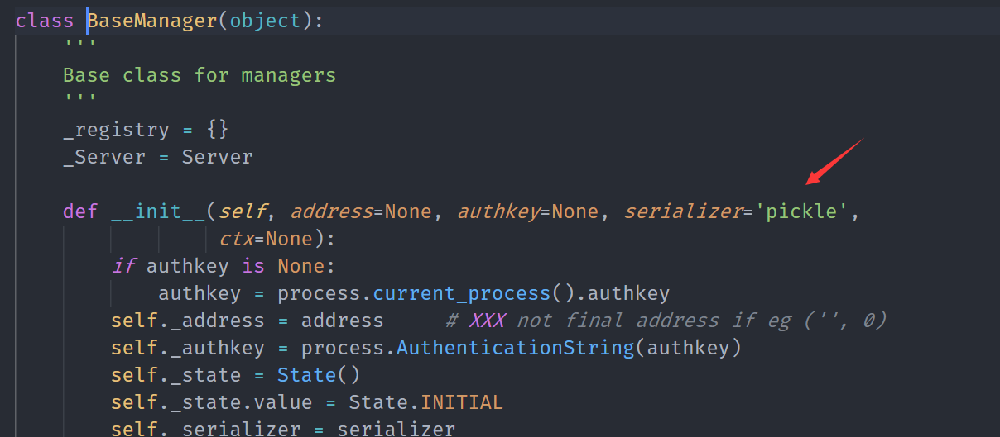
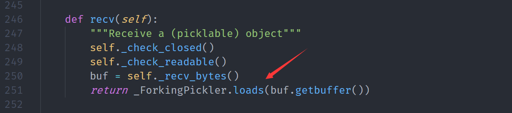
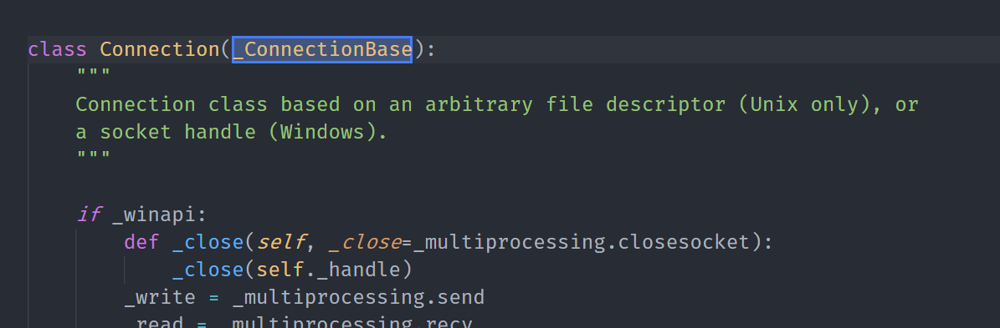
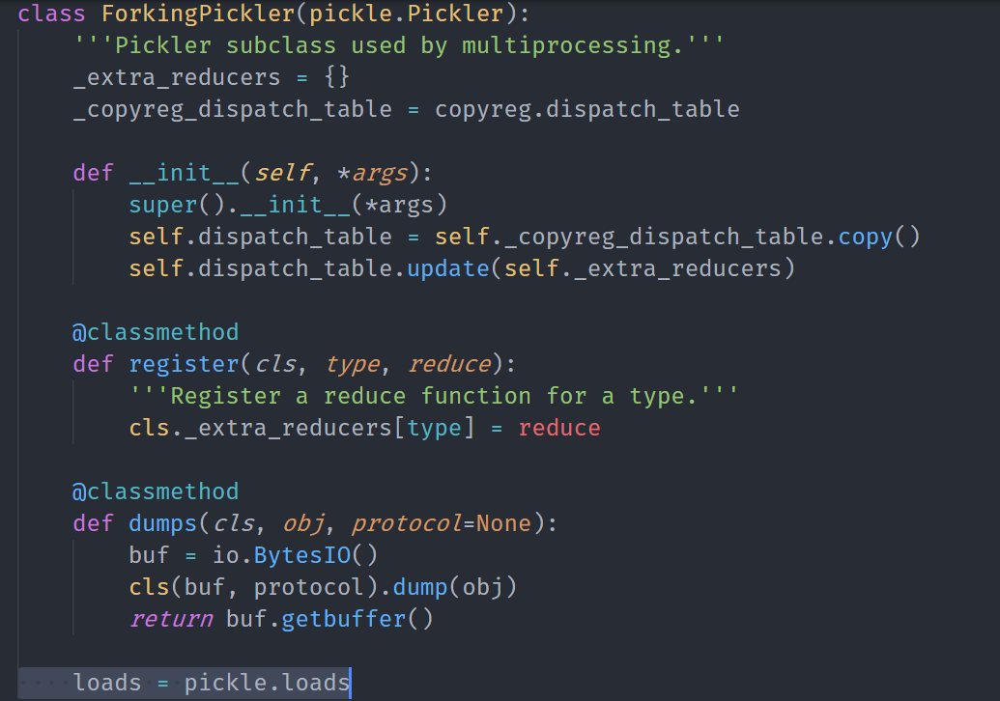
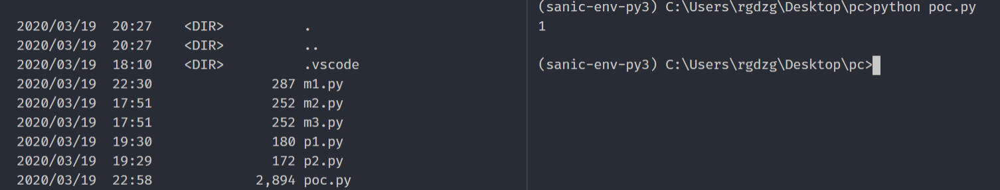

# Python-Remote-code-exec
Python Remote code exec


## Description
When we use python to develop distributed process projects, it is possible to share code between modules that looks like the following

```python
from multiprocessing.managers import BaseManager

class Q():
    pass

class QManager(BaseManager):
    pass

q = Q()
def get_q():
    return q

QManager.register('get_q', callable=get_q)
m = QManager(address=('', 8500), authkey=b'')

s = m.get_server()
s.serve_forever()
```

But I found that pickle was used by default to serialize and deserialize RPC communication, as shown


This is extremely insecure, because when the server accepts the request, pickle.loads will be called for deserialization, which will give the attacker a chance to RCE

The details are shown below


> 
This is the function of ConnectionBase.recv, Here it calls the loads function of the _ForkingPickler module, And this class, as a parent class, is inherited by the others, and the receiving function is completely output from this function
>


>
>It ends up calling pickle.loads to deserialize the remote data, which results in RCE

>So I also think that Pickle is Forking

>But no one seems to pay attention to this problem, so I hope to apply for a CVE-ID to get the attention, which will be very common when using python to develop distributed tasks.

## POC:

[server](./poc/server.py)

[poc](./poc/poc.py)

### demonstration

